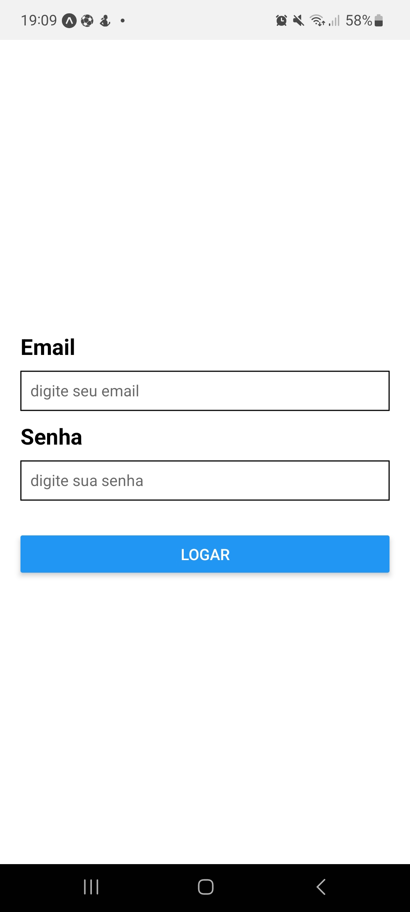
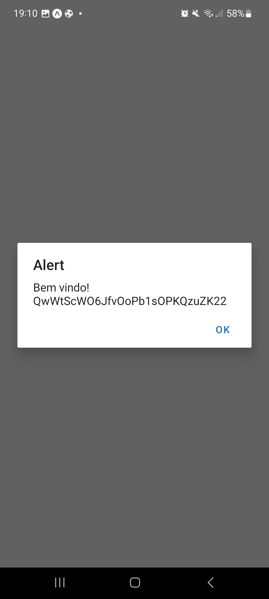
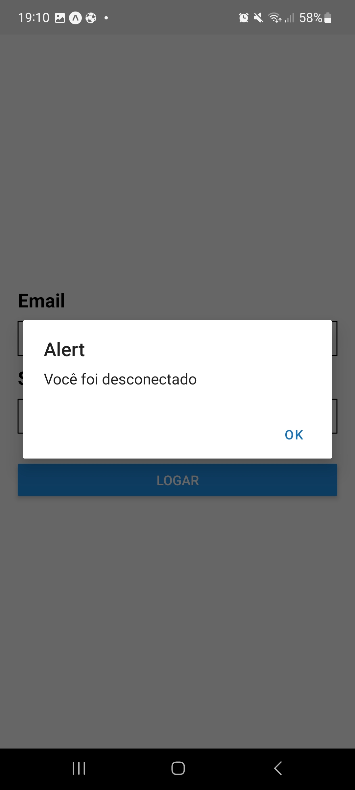
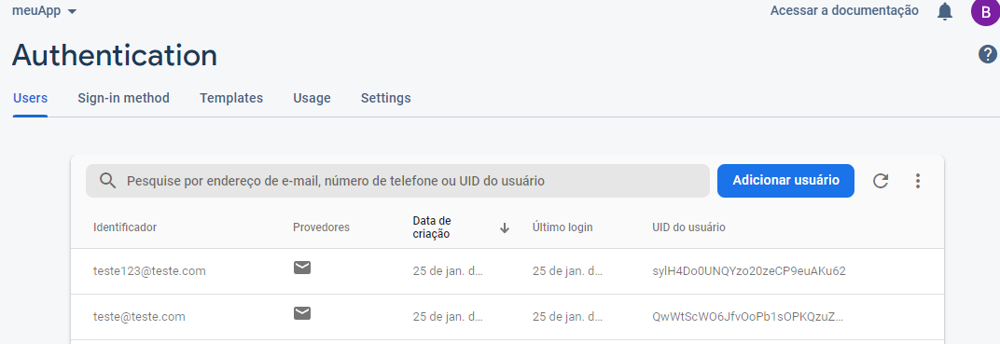

# Interface Login

## technologies:
* React Native
* FireBase

#

## Resume

This application consists of a login interface that consumes user data directly from Firebase, when successfully logging in the user is redirected to their personalized Home, through React Navigation hooks, it is also possible to log out by doing so the user be redirected to the login screen.

## Login screen:

## Login confirmation (Firebase UID):

## Home screen:

## Logout

## Authentication interface in Firebase:

